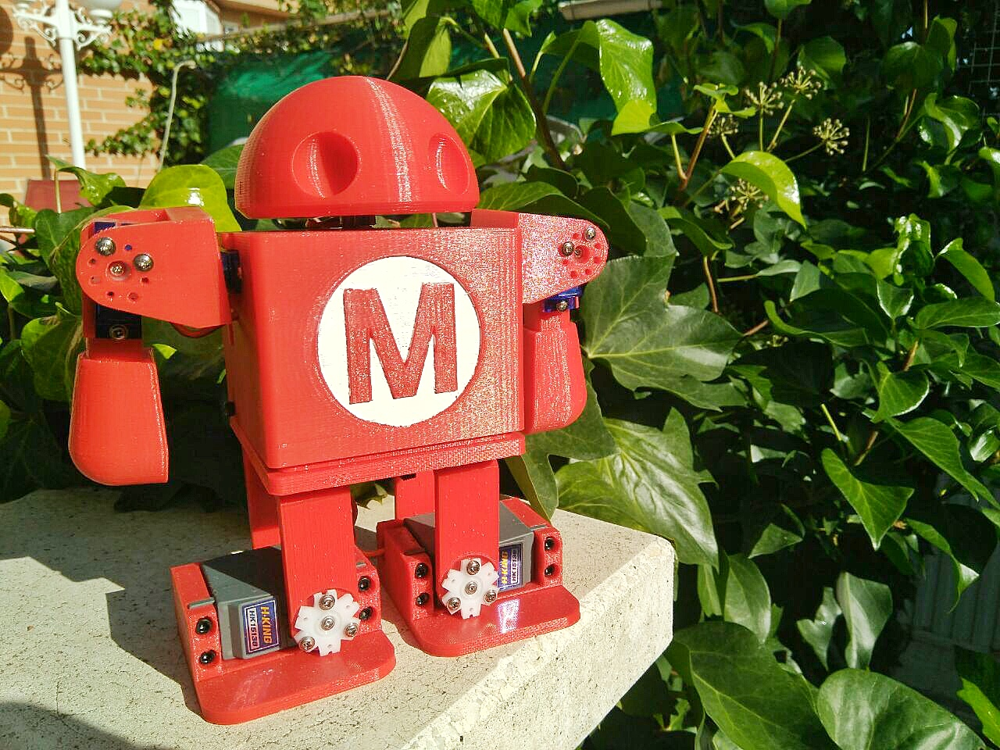

# Zowi Maker Faire Robot

  

**A video of the robot**

  
    

  A Zowi Maker Faire Robot ready to fight!

  This project is based on the amazing work of:

  - Javier Isabel: Creator of the original Zowi and Zowihumanoid

  - ASROB: The  Universidad Carlos III robotics association. Special thanks to Manuel https://github.com/Siotma for the amazing workshop.

  - Zefram: https://www.thingiverse.com/thing:142215

***

 Zowi Maker Faire Robot  created by Julián Caro Linares licensed by <a rel="license" href="http://creativecommons.org/licenses/by-sa/4.0/">Creative Commons Attribution-ShareAlike 4.0 International License</a>.  
